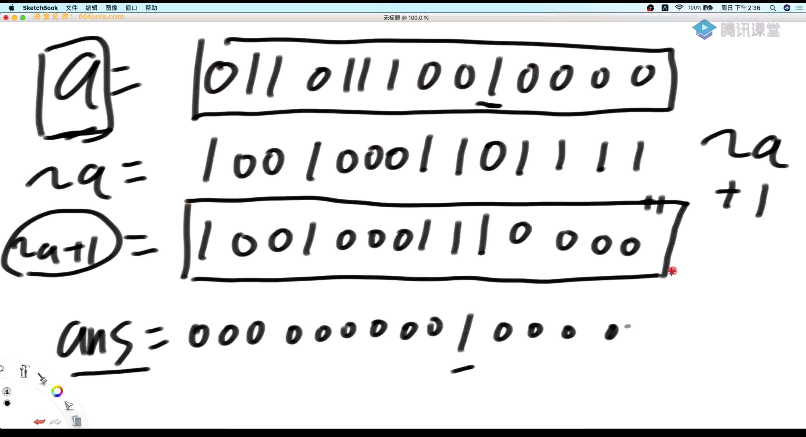
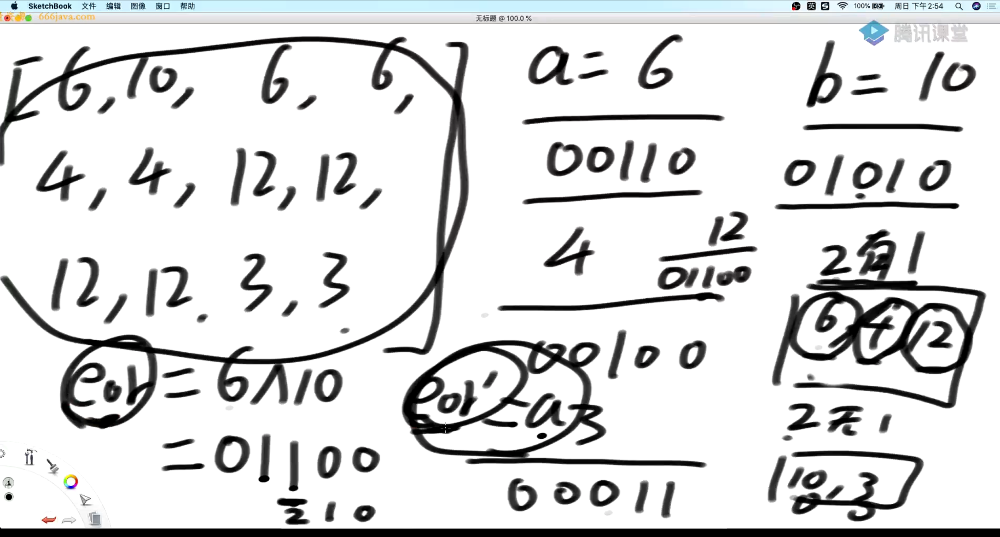
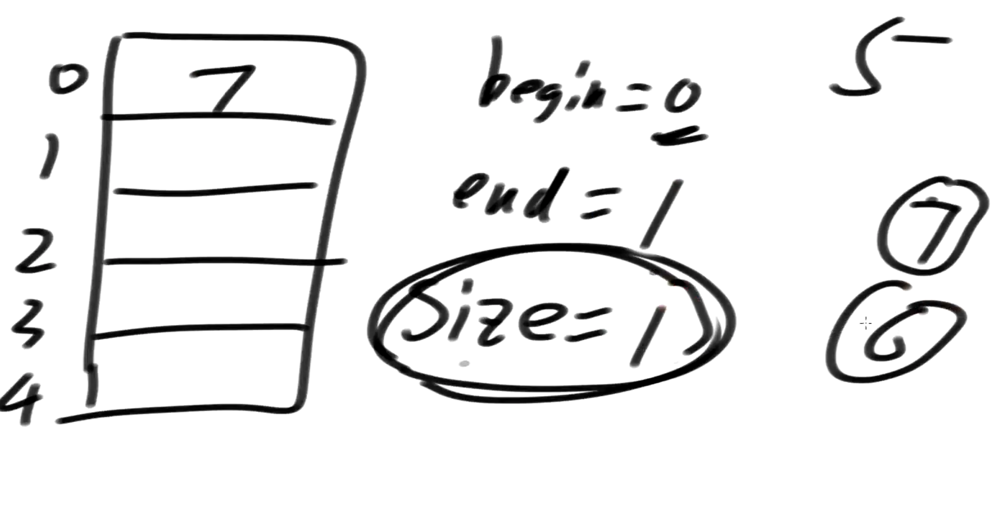
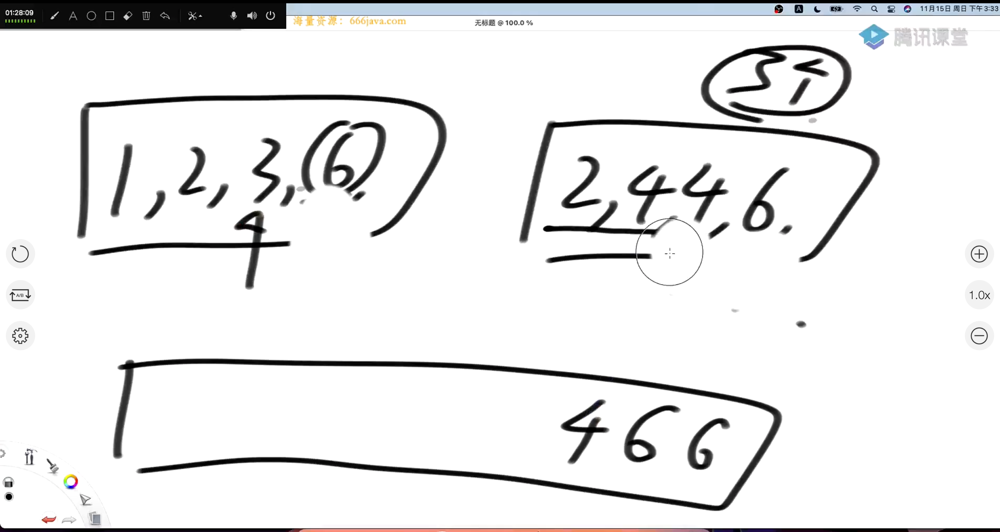
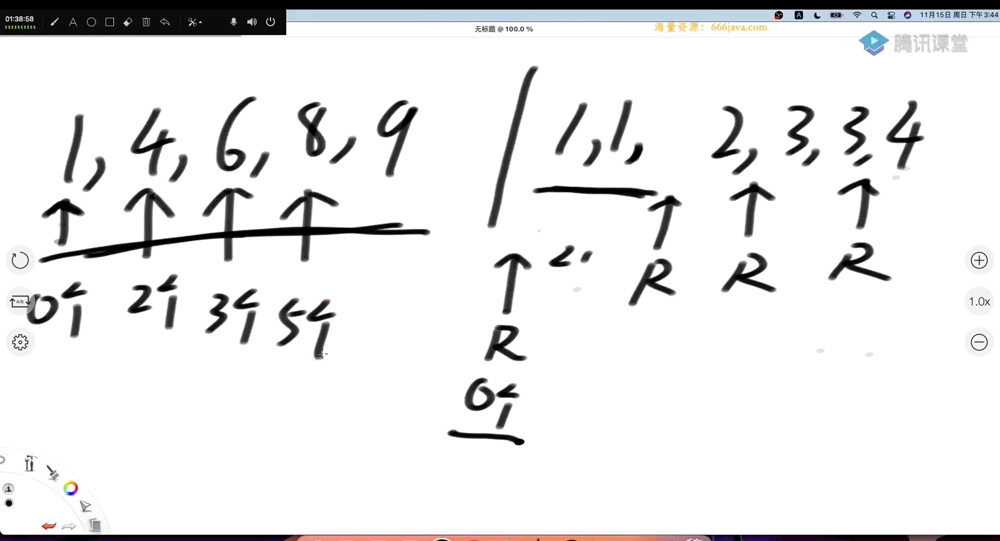

# 第二节 时间复杂度

### 选择排序的时间复杂度：

> 选择排序是一种简单的排序算法，其基本思想是每次从待排序的元素中选择最小（或最大）的元素，然后放到已排序序列的末尾。这个过程不断重复，直到所有元素都被排序完成。
>
> 让我们来分析选择排序的时间复杂度：
>
> 1. **比较次数：**
>    - 在每一轮中，选择排序需要进行一系列的比较来找到未排序部分的最小元素。
>    - 第1轮需要比较n-1次（n为元素个数），第2轮需要比较n-2次，以此类推。
>    - 总的比较次数是 (n-1) + (n-2) + ... + 2 + 1 = n * (n-1) / 2。
>
> 2. **交换次数：**
>    - 在每一轮中，选择排序找到最小元素后，将其与当前未排序部分的第一个元素交换位置。
>    - 最多需要进行n-1次交换。
>
> 因此，选择排序的总时间复杂度可以表示为O(n^2)。具体来说，是O(n^2)的比较次数和O(n)的交换次数之和。
>
> 需要注意的是，选择排序的时间复杂度是平方级别的，因此在大规模数据集上效率较低。在实际应用中，更高效的排序算法，如快速排序（Quick Sort）或归并排序（Merge Sort），通常被更为推荐。
>
> 总的排序次数：
>
> > 总的比较次数是选择排序中执行的元素比较的总次数。让我们具体解释一下选择排序的总的比较次数。
> >
> > 选择排序的算法过程中，每一轮从未排序的元素中选择最小的元素，然后将其与当前未排序部分的第一个元素交换位置。在每一轮中，都需要进行一系列的比较来找到最小的元素。
> >
> > 考虑一个长度为n的数组，选择排序的比较次数如下：
> >
> > - 第1轮比较次数：n - 1次
> > - 第2轮比较次数：n - 2次
> > - 第3轮比较次数：n - 3次
> > - ...
> > - 第n-1轮比较次数：1次
> >
> > 这是一个等差数列，总的比较次数可以通过求和公式得到：
> >
> > \[ \text{总比较次数} = (n-1) + (n-2) + (n-3) + \ldots + 2 + 1 \]
> >
> > 这个和的求和公式可以写为：
> >
> > \[ \text{总比较次数} = \frac{n \cdot (n-1)}{2} \]
> >
> > 因此，选择排序的总比较次数是 \( \frac{n \cdot (n-1)}{2} \) 次。
> >
> > 这是选择排序时间复杂度为O(n^2)的主要原因之一。虽然在实现上它是简单直观的，但是对于大规模的数据集来说，其比较次数的增长速度相对较快，因此在效率上不如一些更高效的排序算法。


常见的时间复杂度

> 1. **O(1) - Constant Time Complexity:**
>    - The algorithm's running time is constant, regardless of the input size.
> 2. **O(log n) - Logarithmic Time Complexity:**
>    - Common in algorithms that divide the problem into smaller subproblems at each step, such as binary search.
> 3. **O(n) - Linear Time Complexity:**
>    - The running time is directly proportional to the size of the input.
> 4. **O(n log n) - Linearithmic Time Complexity:**
>    - Common in efficient sorting algorithms like merge sort and quicksort.
> 5. **O(n^2) - Quadratic Time Complexity:**
>    - The running time is proportional to the square of the input size.
> 6. **O(n^k) - Polynomial Time Complexity:**
>    - General form for polynomial time complexities, where k is a constant.
> 7. **O(2^n) - Exponential Time Complexity:**
>    - The running time grows exponentially with the size of the input. Common in recursive algorithms with overlapping subproblems.
> 8. **O(n!) - Factorial Time Complexity:**
>    - The running time grows factorially with the size of the input. Common in brute-force algorithms that generate all possible permutations or combinations.


# 第三节 异或运算

### 异或的基本定义

异或运算等于无进位相加：在二进制位中，如果相同是0，不相同是1

可以用来不使用额外的空间来交换两个数的值：

a=a^b

b=a^b

a=a^b


### 找到出现了奇数次的数

> 在一个数组中，只有一种数出现了奇数次，其他都出现了偶数次，找到这个数

[4,3,4,2,4,3,1,2,1,1,1,3,3]

把所有数都异或一遍，最终得到的值就是奇数次的数

1111 ^ 22 ^ 3333 ^ 444 -> 0^0^0^0^4 = 4

### 提取整形最右边的1

把一个整形的数的最右侧数提取出来：



ans = a & (~a +1) = a & (-a)

a 与 自己的取反+1

**相反数等于取反+1**

### 出现奇数次的数（二）

> 一个数组中有两种数出现了奇数次，其他的数都出现了偶数次，找到并且打印这两种数

把所有数都异或下来（a ^ b ^c ^d .....)

ans = a^ b

因为a != b，因此 a ^b != 0 因此一定有一个位置是1

找到ans 最右侧的1

找到1了以后，证明在这个位置，a 和 b的值一定是不一样的

解题步骤：

- 先把所有数都异或一遍，ans1 = a ^ b
- 提取出最左边1的位置n
- ans2 = 原数组中所有 n位置为1的数，相互异或，因为分成了两组 因此得到A（其他数因为出现偶数次被消掉了）
- ans2=a 然后ans1= a^b，因此b = ans1 ^ a



# 第四节 基础数据结构

### 数组实现栈

对于数组实现栈，只需要维护一个变量index，表示当前的数要放到哪一个位置，对于弹出操作 让index--即可，不需要实际删除index上的值，因为新加入的值会覆盖掉它


### 数组实现队列

思路：循环数组,用三个变量：begin end 以及size来控制



```java
public void push(int value) {
			if (size == limit) {
				throw new RuntimeException("队列满了，不能再加了");
			}
			size++;
			arr[pushi] = value;
			pushi = nextIndex(pushi);
		}

		public int pop() {
			if (size == 0) {
				throw new RuntimeException("队列空了，不能再拿了");
			}
			size--;
			int ans = arr[polli];
			polli = nextIndex(polli);
			return ans;
		}

		public boolean isEmpty() {
			return size == 0;
		}

		// 如果现在的下标是i，返回下一个位置
		private int nextIndex(int i) {
			return i < limit - 1 ? i + 1 : 0;
		}
```

### 栈最小值

实现思路：用两个栈来实现，压入的时候同步压入，如果当前数比最小值小，那么就压入当前数，否则压入最小数。这样就实现了同步弹出的功能


### 用队列实现栈

解题思路：两个队列来回倒，每次在弹出的时候 ，从 A队列倒到B队列，但是要留下最后一个数 然后弹出

```java
  Queue<Integer> queueIn = new LinkedList<>();
        Queue<Integer> queueOut = new LinkedList<>();
        public MyStack() {
        }

        public void push(int x) {
            queueIn.add( x );
        }

        public int pop() {
            while ( queueIn.size() > 1 ){
                queueOut.add( queueIn.poll() );
            }
            int pop = queueIn.poll();
            queueIn = queueOut;
            queueOut = new LinkedList<>();

            return pop;

        }

        public int top() {
            while ( queueIn.size() > 1 ){
                queueOut.add( queueIn.poll() );
            }
            int pop = queueIn.poll();

            queueIn = queueOut;
            queueIn.add( pop );
            queueOut = new LinkedList<>();

            return pop;
        }

        public boolean empty() {
            return queueIn.isEmpty() && queueOut.isEmpty();
        }
```

### Master公式（递归复杂度）

> 形如
>
> T(N) = a * T(N/b) + O(N^d)(其中的a、b、d都是常数)
>
> 的递归函数，可以直接通过Master公式来确定时间复杂度
>
> 如果 log(b,a) < d，复杂度为O(N^d)
>
> 如果 log(b,a) > d，复杂度为O(N^log(b,a))
>
> 如果 log(b,a) == d，复杂度为O(N^d * logN)

### 归并排序

思路：找到中点mid，先让左边有序，再让右边有序，最后merge合并（比较）

```java
class Solution {
    public static void process(int[] array,int L, int R){
        if ( L == R ){
            return;
        }
        int mid = L +((R-L) >>1); //这里注意要带括号
        process( array,L,mid );
        process( array,mid+1, R );
        merge( array,L,mid,R );

    }

    public static void merge(int[] array,int L, int mid, int R){
        //L -mid 有序
        // mid+1 - R有序
        int[] helpArray = new int[R - L +1];
        int helpIndex = 0;
        int p1 = L;
        int p2 = mid +1;
        while ( p1 <= mid && p2 <= R ){
            helpArray[helpIndex++] = array[p1] <= array[p2] ? array[p1++]:array[p2++];
        }
        //到这里一定会有越界的情况，
        while ( p1 <= mid  ){
            helpArray[helpIndex++] = array[p1++];
        }
        while ( p2 <= R ){
            helpArray[helpIndex++] = array[p2++];
        }
        //help 数组拷贝回去
        for ( int i = 0; i < helpArray.length; i++ ) {
            array[L +i] = helpArray[i];
        }
    }
    public int[] sortArray(int[] array) {
        process( array,0,array.length-1 );
        return array;
    }
}
```


### 最小和问题

给一个数组 [6,3,2,1,6,7] 

对于6，左边比他小的数的累加和是0，对于3 比他小的数累加和是0，对于6 所有左边比它小的数是 3+2+1 = 6，对于7 则是18.

- 把问题转换为 左边右多少个数比它小 - > 右边有多少个数比它大

- 拷贝右组的时候不产生小和
- 如果相等，那么要挪动右组的指针，因为左组还要继续计算后面右组的小和

因此应输出 6+18 = 24

解题思路：merge sort，在merge的时候 需要累加小和

```java
public static int merge(int[] arr, int L, int m, int r) {
		int[] help = new int[r - L + 1];
		int i = 0;
		int p1 = L;
		int p2 = m + 1;
		int res = 0;
		while (p1 <= m && p2 <= r) {
			//核心代码：如果左组的数小于右组的数，那么意味着会有小和产生
			//因为此时merge的时候，左右组均为有序 因此当判断到第一个 在右组大于左组当前指针的时候
			//可以判定会有r - p2 + 1 个小和产生，并且需要乘以当前左组的数：arr[p1]
      //如果两个数相等，那么应该挪右边的指针，因为左边能产生小和，右边还没有判断完 只是因为当前数相等了，所以应该把右指针挪一位，继续判断是否会有小和产生，如果挪动左指针，那么就相当于当前数直接跳过去了
			res += arr[p1] < arr[p2] ? (r - p2 + 1) * arr[p1] : 0;
			help[i++] = arr[p1] < arr[p2] ? arr[p1++] : arr[p2++];
		}
		while (p1 <= m) {
			help[i++] = arr[p1++];
		}
		while (p2 <= r) {
			help[i++] = arr[p2++];
		}
		for (i = 0; i < help.length; i++) {
			arr[L + i] = help[i];
		}
		return res;
	}

public static int process(int[] arr, int l, int r) {
		if (l == r) {
			return 0;
		}
		// l < r
		int mid = l + ((r - l) >> 1);
		//左边产生的小和+右边产生的小和+merge 产生的小和
		return
				process(arr, l, mid) 
				+ 
				process(arr, mid + 1, r) 
				+ 
				merge(arr, l, mid, r);
	}
```

# 第五节 基础数据结构（需要笔记！）

### merge sort 递归

```java
// 请把arr[L..R]排有序
	// l...r N
	// T(N) = 2 * T(N / 2) + O(N)
	// O(N * logN)
	public static void process(int[] arr, int L, int R) {
		if (L == R) { // base case
			return;
		}
		int mid = L + ((R - L) >> 1);
		process(arr, L, mid);
		process(arr, mid + 1, R);
		merge(arr, L, mid, R);
	}

	public static void merge(int[] arr, int L, int M, int R) {
		int[] help = new int[R - L + 1];
		int i = 0;
		int p1 = L;
		int p2 = M + 1;
		while (p1 <= M && p2 <= R) {
			help[i++] = arr[p1] <= arr[p2] ? arr[p1++] : arr[p2++];
		}
		// 要么p1越界了，要么p2越界了
		while (p1 <= M) {
			help[i++] = arr[p1++];
		}
		while (p2 <= R) {
			help[i++] = arr[p2++];
		}
		for (i = 0; i < help.length; i++) {
			arr[L + i] = help[i];
		}
	}
```


### 非递归版本

引入步长概念，分为左组和右组，进行merge

如果凑不成一对左组右组，那么直接跳下一个。步长一次递增 *2

如果步长超过整个数组的长度，那么就停止

```java
public static void mergeSort2(int[] arr) {
		if (arr == null || arr.length < 2) {
			return;
		}
		int N = arr.length;
		// 步长
		int mergeSize = 1;
		while (mergeSize < N) { // log N
			// 当前左组的，第一个位置,左组一定是从0 开始，每次递增的只有步长
			int L = 0;
			while (L < N) {
        //当前左组的最后一个位置
				int M = L + mergeSize - 1;
        
				if (M >= N) {
					break;
				}
				int R = M + Math.min(mergeSize, N - M - 1);
				merge(arr, L, M, R);
				L = R + 1;
			}
			// 防止溢出 
			if (mergeSize > N / 2) {
				break;
			}
      //左移一位
			mergeSize <<= 1;
		}
	
```


### 逆序对

> 给定一个数组例如[3,1,0,4,3,1] 如果左的数比右边的数大，两个则称为逆序对
>
> 3,1  3,0  3,1  1,0  4,3  4,1  3,1
>
> 

方法：从左往右merge

如果两个数相等，一定要移动右边的，因为只有左组会产生逆序对


### 右边乘2 小于

求出右边有多少个数，乘二都不如当前数大



#### 启示：

当需要求某一个数的右边，或者左边怎么样的时候，都可以往merge sort 的思维靠

## 第六节 快排，归并排序附加

### 归并排序的补充题目：

> Given an integer array `nums` and two integers `lower` and `upper`, return *the number of range sums that lie in*`[lower, upper]` *inclusive*.
>
> Range sum `S(i, j)` is defined as the sum of the elements in `nums` between indices `i` and `j` inclusive, where `i <= j`.

优化思路：

1. 最暴力的算法，列出所有子数组 N^2，并且对所有子数组求和N 一共N^3
2. 计算出前缀和presum，求2-4 的前缀和 等于 0-4的前缀和 减去 0-1 的前缀和，可以优化为N^2
3. 根据merge sort来进行计算，可优化到NlogN 的时间复杂度，以下讲的是这种方法

求以0下表结尾的子数组有几个达标： 0-0

求以1下表结尾的子数组有几个达标： 1-1,1-0

求以2下表结尾的子数组有几个达标： 2-2,1-2,0-2  ......

相加即可

**这节先跳过！有点难**


## 第七节 堆排序

完全二叉树：

> 一棵深度为k的有n个结点的**二叉树**，对树中的结点按从上至下、从左到右的顺序进行编号，如果编号为i（1≤i≤n）的结点与满**二叉树**中编号为i的结点在**二叉树**中的位置相同，则这棵**二叉树**称为**完全二叉树**
>
> 上面的层一定是满的，如果是不满的层 那么要从左往右填充


对于一串连续的数组，可以构建出完全二叉树。对于某一个节点i，有如下定理：

- 左节点：2*i +1
- 右节点：2*i +2
- 父节点：i-1 /2 向下取整（舍弃小数）

大根堆和小跟堆的定义：

大根堆：头结点是这棵树的最大值

小根堆：头结点是这棵树的最小值
